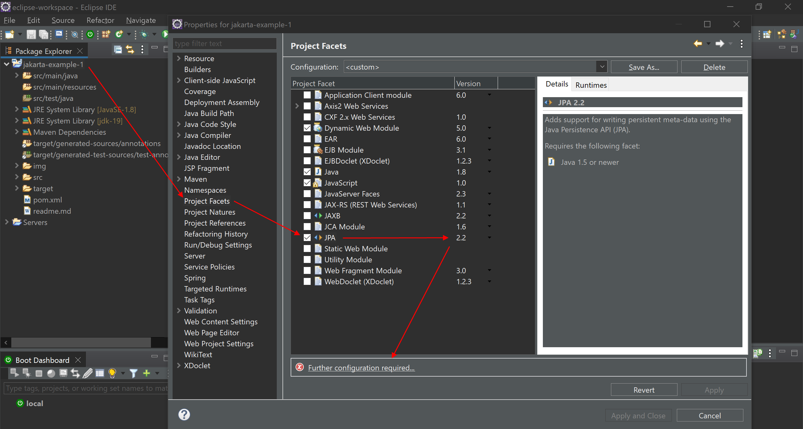

# Jakarta Ejemplo 1


# 0. Crear el proyecto

Creamos un artefacto con el arquetipo de webapps, le añadimos las dependencias al *pom.xml*, añadimos el JDK-19 al *build path*, y hacemos el *maven install* sobre el *pom.xml*, y actualizamos el proyecto con *maven --> update project*

```xml
<!-- ********************************* PostgreSQL ************************************* -->
	<dependency>
	    <groupId>org.postgresql</groupId>
	    <artifactId>postgresql</artifactId>
	    <version>42.5.0</version>
	</dependency>
	
	<!-- ********************************* Jakarta ************************************* -->
	<dependency>
	    <groupId>jakarta.servlet</groupId>
	    <artifactId>jakarta.servlet-api</artifactId>
	    <version>6.0.0</version>
	    <scope>provided</scope>
	</dependency>

	<dependency>
	    <groupId>jakarta.servlet.jsp</groupId>
	    <artifactId>jakarta.servlet.jsp-api</artifactId>
	    <version>3.1.0</version>
	    <scope>provided</scope>
	</dependency>

	<dependency>
	    <groupId>jakarta.servlet.jsp.jstl</groupId>
	    <artifactId>jakarta.servlet.jsp.jstl-api</artifactId>
	    <version>3.0.0</version>
	</dependency>

	<dependency>
	    <groupId>jakarta.annotation</groupId>
	    <artifactId>jakarta.annotation-api</artifactId>
	    <version>2.1.1</version>
	</dependency>

	<dependency>
	    <groupId>jakarta.xml.bind</groupId>
	    <artifactId>jakarta.xml.bind-api</artifactId>
	    <version>4.0.0</version>
	</dependency>

	<dependency>
	    <groupId>jakarta.inject</groupId>
	    <artifactId>jakarta.inject-api</artifactId>
	    <version>2.0.1</version>
	</dependency>

	<dependency>
	    <groupId>jakarta.ws.rs</groupId>
	    <artifactId>jakarta.ws.rs-api</artifactId>
	    <version>3.1.0</version>
	</dependency>

	<dependency>
	    <groupId>jakarta.validation</groupId>
	    <artifactId>jakarta.validation-api</artifactId>
	    <version>3.0.2</version>
	</dependency>

	<dependency>
	    <groupId>jakarta.persistence</groupId>
	    <artifactId>jakarta.persistence-api</artifactId>
	    <version>3.1.0</version>
	</dependency>

	<dependency>
	    <groupId>jakarta.activation</groupId>
	    <artifactId>jakarta.activation-api</artifactId>
	    <version>2.1.0</version>
	</dependency>
	
	<!-- ********************************* Hibernate ************************************* -->
	<dependency>
	    <groupId>org.hibernate.validator</groupId>
	    <artifactId>hibernate-validator</artifactId>
	    <version>8.0.0.Final</version>
	</dependency>

	<dependency>
	    <groupId>org.hibernate.orm</groupId>
	    <artifactId>hibernate-core</artifactId>
	    <version>6.1.5.Final</version>
	</dependency>
	
	<dependency>
	    <groupId>org.hibernate</groupId>
	    <artifactId>hibernate-core-jakarta</artifactId>
	    <version>5.6.14.Final</version>
	</dependency>
<!--
	<dependency>
	    <groupId>org.hibernate</groupId>
	    <artifactId>hibernate-annotations</artifactId>
	    <version>3.5.6-Final</version>
	</dependency>
-->
	<dependency>
	    <groupId>org.hibernate.javax.persistence</groupId>
	    <artifactId>hibernate-jpa-2.1-api</artifactId>
	    <version>1.0.2.Final</version>
	</dependency>

	<dependency>
	    <groupId>org.eclipse.persistence</groupId>
	    <artifactId>org.eclipse.persistence.jpa</artifactId>
	    <version>4.0.0</version>
	</dependency>
```


**Nota**: también comprobamos la versión del *dynamic web module*.


# 1. Creamos un servlet

en *src/main/java* creamos un nuevo paquete llamado *com.example* y le añadimos un nuevo archivo de tipo servlet, y en él, cambiamos las importaciones automáticas de *javax* por *jakarta*.


# 2. Añadimos su enrutado

```java
/**
 * Servlet implementation class HelloServlet
 */
@WebServlet(name = "HelloServlet", value = "/hello")
public class HelloServlet extends HttpServlet { 
    
    ... 

    /**
	 * @see HttpServlet#doGet(HttpServletRequest request, HttpServletResponse response)
	 */
	protected void doGet(HttpServletRequest request, HttpServletResponse response) throws ServletException, IOException {
		// TODO Auto-generated method stub
		response.getWriter().append("Served at: Hello World");
	}

    ...
}
```

Añadimos el servidor de Tomcat 10 y lo iniciamos. Vamos a nuestro navegador y escribimos la ruta.


# 3. Conexión con la BBDD


## 3.1. com.tools --> VariablesConexionPostgreSql.java

```java
package com.tools;

public class VariablesConexionPostgreSql {

	//Datos de conexión a PostgreSQL
	static final String USER = "postgres";
	static final String PASS = "12345";
	static final String PORT = "5432";
	static final String HOST = "localhost";
	static final String DB = "jakarta-example-1";	
		
	public static String getUser() {
		return USER;
	}
	public static String getPass() {
		return PASS;
	}
	public static String getPort() {
		return PORT;
	}
	public static String getHost() {
		return HOST;
	}
	public static String getDb() {
		return DB;
	}
}
```

## 3.2. com.connections --> ConexionPostgreSql.java

```java
package com.connections;

import java.sql.Connection;
import java.sql.DriverManager;

public class ConexionPostgreSql {

	public Connection generaConexion(final String host, final String port, final String db, final String user, final String pass) {

		System.out.println("\n[INFORMACIÓN-conexionPostgresql-generaConexion] Entra en generaConexion");
		
        Connection conexion = null;
        String url = "jdbc:postgresql://" + host + ":" + port + "/" + db;            
		
        try {	
            try {
                Class.forName("org.postgresql.Driver");
            
            } catch (ClassNotFoundException cnfe) {
                System.out.println("\n[ERROR-conexionPostgresql-generaConexion] Error en registro driver PostgreSQL: " + cnfe);
            }
      
            conexion = DriverManager.getConnection(url, user, pass);           
            
            boolean esValida = conexion.isValid(50000);
            
            if(esValida == false) {
            	conexion = null;
            }
            
            System.out.println(esValida ? "\n[INFORMACIÓN-conexionPostgresql-generaConexion] Conexión a PostgreSQL válida" : "[ERROR-conexionPostgresql-generaConexion] Conexión a PostgreSQL no válida");
            
            return conexion;
            
        } catch (java.sql.SQLException jsqle) {
            System.out.println("\n[ERROR-conexionPostgresql-generaConexion] Error en conexión a PostgreSQL (" + url + "): " + jsqle);
            
            return conexion;
        }		
	}
}
```

# 4. Operaciones CRUD


## 4.1. com.queries --> ConsultasPostgreSql.java

```java
package com.queries;

import java.sql.Connection;
import java.sql.ResultSet;
import java.sql.SQLException;
import java.sql.Statement;

import com.connections.ConexionPostgreSql;
import com.tools.VariablesConexionPostgreSql;

public class ConsultasPostgreSql {

/**************************************** CONSULTAS SELECT *********************************************/
	
    public static void ConsultaSelectEmpleados(Connection conexionGenerada)
    {
        Statement declaracionSQL = null;
		ResultSet resultadoConsulta = null;
		
		ConexionPostgreSql conexionPostgreSql = new ConexionPostgreSql();		
		conexionGenerada = conexionPostgreSql.generaConexion(VariablesConexionPostgreSql.getHost(), VariablesConexionPostgreSql.getPort(), VariablesConexionPostgreSql.getDb(), VariablesConexionPostgreSql.getUser(), VariablesConexionPostgreSql.getPass());
				
		if(conexionGenerada != null) {
			
			try {
				declaracionSQL = conexionGenerada.createStatement();
				resultadoConsulta = declaracionSQL.executeQuery("SELECT * FROM \"public\".\"employees\"");
				
				while(resultadoConsulta.next()) {
					Long id = resultadoConsulta.getLong("id");
					String name = resultadoConsulta.getString("name");
					String nif = resultadoConsulta.getString("nif");
					int age = resultadoConsulta.getInt("age");
					
					System.out.println(id + " - " + name + " - " + nif + " - " + age);
				}
				
			    resultadoConsulta.close();
			    declaracionSQL.close();
			    conexionGenerada.close();
				
			} catch (SQLException e) {
				System.out.println("\n[ERROR-Consultas-ConsultasPostgreSQL.java] Error generando la declaracionSQL: " + e);
			}
		}		
    }    
}
```

## 4.2. com.example --> HelloServlet.java

```java
/**
	 * @see HttpServlet#doGet(HttpServletRequest request, HttpServletResponse response)
	 */
	protected void doGet(HttpServletRequest request, HttpServletResponse response) throws ServletException, IOException {
		// TODO Auto-generated method stub
		response.getWriter().append("Served at: Hello World");
		
		Connection conexionGenerada = null;
		
		try {
			ConsultasPostgreSql.ConsultaSelectEmpleados(conexionGenerada);
			
		} catch (Exception e) {
			// TODO: handle exception
		}
	}
```


# 5. Capa DAO


## 5.1. com.models --> Employee.java

```java
package com.models;

public class Employee {

	// ATRIBUTOS
	private Long id;
	private String name;
	private String nif;
	private int age;
	
	
	// CONSTRUCTORES
	public Employee(Long id, String name, String nif, int age) {
		super();
		this.id = id;
		this.name = name;
		this.nif = nif;
		this.age = age;
	}

	public Employee() {
		super();
	}
	
	
	// GETTERS Y SETTERS
	public Long getId() {
		return id;
	}

	public void setId(Long id) {
		this.id = id;
	}

	public String getName() {
		return name;
	}

	public void setName(String name) {
		this.name = name;
	}

	public String getNif() {
		return nif;
	}

	public void setNif(String nif) {
		this.nif = nif;
	}

	public int getAge() {
		return age;
	}

	public void setAge(int age) {
		this.age = age;
	}


	// ToString
	@Override
	public String toString() {
		return "\nEmployee [id=" + id + ", name=" + name + ", nif=" + nif + ", age=" + age + "]";
	}
}
```

## 5.2. com.interfaces --> EmployeeDAO.java

```java
package com.interfaces;

import java.util.List;

import com.models.Employee;

public interface EmployeeDAO {

	List<Employee> findAll();
	Employee findOne(Long id);
	boolean create(Employee employee);
	boolean update(Employee employee);	
	boolean delete(Long id);
}
```

## 5.3. Actualizamos el método de la consulta select

```java
package com.queries;

import java.sql.Connection;
import java.sql.ResultSet;
import java.sql.SQLException;
import java.sql.Statement;
import java.util.ArrayList;
import java.util.List;

import com.connections.ConexionPostgreSql;
import com.models.Employee;
import com.tools.VariablesConexionPostgreSql;

public class ConsultasPostgreSql {

/**************************************** CONSULTAS SELECT *********************************************/
	
    public static List<Employee> ConsultaSelectEmpleados()
    {
    	List<Employee> employeesList = new ArrayList<>();
        Statement declaracionSQL = null;
		ResultSet resultadoConsulta = null;
		
		ConexionPostgreSql conexionPostgreSql = new ConexionPostgreSql();		
		Connection conexionGenerada = conexionPostgreSql.generaConexion(VariablesConexionPostgreSql.getHost(), VariablesConexionPostgreSql.getPort(), VariablesConexionPostgreSql.getDb(), VariablesConexionPostgreSql.getUser(), VariablesConexionPostgreSql.getPass());
				
		if(conexionGenerada != null) {
			
			try {
				declaracionSQL = conexionGenerada.createStatement();
				resultadoConsulta = declaracionSQL.executeQuery("SELECT * FROM \"public\".\"employees\"");
				
				while(resultadoConsulta.next()) {
					Long id = resultadoConsulta.getLong("id");
					String name = resultadoConsulta.getString("name");
					String nif = resultadoConsulta.getString("nif");
					int age = resultadoConsulta.getInt("age");
					
					System.out.println(id + " - " + name + " - " + nif + " - " + age);
					
					Employee employee = new Employee(id, name, nif, age);
					employeesList.add(employee);
				}
				
			    resultadoConsulta.close();
			    declaracionSQL.close();
			    conexionGenerada.close();
				
			} catch (SQLException e) {
				System.out.println("\n[ERROR-Consultas-ConsultasPostgreSQL.java] Error generando la declaracionSQL: " + e);
			}
		}	
		
		return employeesList;
    }
}
```

# 5.4. com.implementations --> EmployeeImpl.java

```java
package com.implementations;

import java.sql.Connection;
import java.util.ArrayList;
import java.util.List;

import com.interfaces.EmployeeDAO;
import com.models.Employee;
import com.queries.ConsultasPostgreSql;

public class EmployeeImpl implements EmployeeDAO{

	@Override
	public List<Employee> findAll() {

		List<Employee> employeesList = new ArrayList<>();
		Connection conexionGenerada = null;
		
		try {
			employeesList = ConsultasPostgreSql.ConsultaSelectEmpleados(conexionGenerada);
			
		} catch (Exception e) {
			// TODO: handle exception
		}
		
		return employeesList;
	}

	@Override
	public Employee findOne(Long id) {
		// TODO Auto-generated method stub
		return null;
	}

	@Override
	public boolean create(Employee employee) {
		// TODO Auto-generated method stub
		return false;
	}

	@Override
	public boolean update(Employee employee) {
		// TODO Auto-generated method stub
		return false;
	}

	@Override
	public boolean delete(Long id) {
		// TODO Auto-generated method stub
		return false;
	}	
}
```

## 5.5. Volvemos al HelloServlet.java

```java
/**
	 * @see HttpServlet#doGet(HttpServletRequest request, HttpServletResponse response)
	 */
	protected void doGet(HttpServletRequest request, HttpServletResponse response) throws ServletException, IOException {
		
		EmployeeDAO employeeDAO = new EmployeeImpl(); // polimorfismo
		
		response.getWriter().append(employeeDAO.findAll().toString());
	}
```


# 5.6. Hacemos la consulta insert

### ConsultasPostgreSql.java

```java
/*************************************** CONSULTAS INSERTS ******************************************/
    public static boolean ConsultaInsertEmpleado(Employee employee)
    {
    	boolean result = false;
        PreparedStatement declaracionSQL = null;
		ConexionPostgreSql conexionPostgreSql = new ConexionPostgreSql();
		
		Connection conexionGenerada = conexionPostgreSql.generaConexion(VariablesConexionPostgreSql.getHost(), VariablesConexionPostgreSql.getPort(), VariablesConexionPostgreSql.getDb(), VariablesConexionPostgreSql.getUser(), VariablesConexionPostgreSql.getPass());
				
		if(conexionGenerada != null) {
			
			try {
				declaracionSQL = conexionGenerada.prepareStatement("INSERT INTO \"public\".\"employees\" (name, nif, age) VALUES (?, ?, ?)");
				
				declaracionSQL.setString(1, employee.getName());
				declaracionSQL.setString(2, employee.getNif());
				declaracionSQL.setInt(3, employee.getAge());
				
				declaracionSQL.executeUpdate();
				result = true;
				
			    declaracionSQL.close();
			    conexionGenerada.close();
				
			} catch (SQLException e) {
				System.out.println("\n[ERROR-Consultas-ConsultasPostgreSQL.java] Error generando la declaracionSQL: " + e);
			}
		}
		
		return result;
    }
```

### EmployeeImpl.java

```java
@Override
	public boolean create(Employee employee) {

		boolean result = false;
		
		result = ConsultasPostgreSql.ConsultaInsertEmpleado(employee);
		
		return result;
	}
```

### HelloServlet.java

```java
/**
	 * @see HttpServlet#doGet(HttpServletRequest request, HttpServletResponse response)
	 */
	protected void doGet(HttpServletRequest request, HttpServletResponse response) throws ServletException, IOException {
		
		EmployeeDAO employeeDAO = new EmployeeImpl(); // polimorfismo
		
		Employee testEmployee = new Employee(null, "testEmployee", "44444444D", 18);
		
		employeeDAO.create(testEmployee);
		
		response.getWriter().append(employeeDAO.findAll().toString());
	}
```


# 6. Conexión del proyecto con Hibernate


## 6.1. Cambiar el tipo de proyecto a JPA

**Atención**: No hacer este paso, no es necesario, y de hacerlo, me da error el *persistence.xml*




## 6.2. persistance.xml

La acción de Project Face --> JPA nos ha creado una carpeta *META-INF*, y dentro de ella un archivo llamado *persistance.xml*...

**Atención**: creamos nosotros mismos la carpeta META-INF dentro del paquete *src/main/java*. Y dentro de META-INF creamos un archivo xml llamado *persistence.xml*


```xml
<?xml version="1.0" encoding="UTF-8"?>
<!-- <?xml version="1.0" encoding="UTF-8" standalone="yes"?> ............... el standalone hace que EntityManagerFactory no pueda reconocer el name de mi <persistence-unit> -->

<persistence 
	xmlns="https://jakarta.ee/xml/ns/persistence"
    xmlns:xsi="http://www.w3.org/2001/XMLSchema-instance"
    xsi:schemaLocation="https://jakarta.ee/xml/ns/persistence https://jakarta.ee/xml/ns/persistence/persistence_3_0.xsd"
    version="3.0"
>
    <persistence-unit name="default">

        <provider>org.hibernate.jpa.HibernatePersistenceProvider</provider>
        <properties>
            <property name="hibernate.connection.url" value="jdbc:postgresql://localhost/jakarta-example-1"/>
            <property name="hibernate.connection.driver_class" value="org.postgresql.Driver"/>
            <property name="hibernate.connection.username" value="postgres"/>
            <property name="hibernate.connection.password" value="12345"/>
            <property name="hibernate.archive.autodetection" value="class"/>
            <property name="hibernate.show_sql" value="true"/>
            <property name="hibernate.format_sql" value="true"/>
            <property name="hibernate.hbm2ddl.auto" value="create"/>
        </properties>
    </persistence-unit>
</persistence>
```

# 7. Entidades JPA


```xml
<dependency>
	<groupId>org.hibernate</groupId>
	<artifactId>hibernate-core-jakarta</artifactId>
	<version>5.6.14.Final</version>
</dependency>
```

**Nota**: *run as --> maven install*

## 7.1. Añadir anotaciones al modelo Employee.java

```java
...
import jakarta.persistence.Entity;
import jakarta.persistence.GeneratedValue;
import jakarta.persistence.GenerationType;
import jakarta.persistence.Id;
import jakarta.persistence.Table;

@Entity
@Table(name = "employees")
public class Employee {

	// ATRIBUTOS
	@Id
	@GeneratedValue(strategy = GenerationType.IDENTITY)
	private Long id;
	private String name;
	private String nif;
	private int age;
...
```

## 7.2. EntityManagerFactory en el controlador de HelloServlet

```java
/**
	 * @see HttpServlet#doGet(HttpServletRequest request, HttpServletResponse response)
	 */
	protected void doGet(HttpServletRequest request, HttpServletResponse response) throws ServletException, IOException {
		
		EntityManagerFactory emf = Persistence.createEntityManagerFactory("default");
		EntityManager em = emf.createEntityManager();
		Employee employee1 = em.find(Employee.class, 1L);
		System.out.println(employee1);
		
		// EmployeeDAO employeeDAO = new EmployeeImpl(); // polimorfismo
		// Employee testEmployee = new Employee(null, "testEmployee", "44444444D", 18);
		// employeeDAO.create(testEmployee);
		
		// response.getWriter().append(employeeDAO.findAll().toString());
		response.getWriter().append("Hola Mundo");
	}
```


# 8. Operaciones CRUD con JPA Hibernate


### HelloServlet.java

```java
/**
	 * @see HttpServlet#doGet(HttpServletRequest request, HttpServletResponse response)
	 */
	protected void doGet(HttpServletRequest request, HttpServletResponse response) throws ServletException, IOException {
		
		EntityManagerFactory emf = Persistence.createEntityManagerFactory("default");
		EntityManager em = emf.createEntityManager();
		
		/********************************** persist (insert) ********************************/
		em.getTransaction().begin();
        Employee employeeJPA = new Employee(null, "EmployeeJPA", "hibernate", 30);
        em.persist(employeeJPA);
        em.getTransaction().commit();

		/********************************** find (search) ********************************/
		Employee employee1 = em.find(Employee.class, 1L);
		System.out.println(employee1);
		
		/********************************** merge (update) ********************************/
		em.getTransaction().begin();
		employee1.setName(employee1.getName() + "_editado");
		em.merge(employeeJPA);
		em.getTransaction().commit();

		// delete
		em.getTransaction().begin();
		em.remove(employeeJPA);
		em.getTransaction().commit();
		
		// EmployeeDAO employeeDAO = new EmployeeImpl(); // polimorfismo
		// Employee testEmployee = new Employee(null, "testEmployee", "44444444D", 18);
		// employeeDAO.create(testEmployee);
		
		// response.getWriter().append(employeeDAO.findAll().toString());
		response.getWriter().append("Hola Mundo");
	}
```

Si a priori, comentamos la parte del *delete* y ejecutamos el proyecto, podremos ver en pgAdmin que se ha creado un empleado. Y si después descomentamos el *delete* y lo volvemos a ejecutar, vemos que elimina tal empleado y se queda la tabla vacía.

# 9. Capa DAO con JPA Hibernate


Vamos a abstraer la creación del contexto de EntityManager.

Para ello, vamos a extraer las dos sentencias de código de nuestro *HelloServlet.java*, para llevárnoslas a una nueva clase (*com.example.tools --> JPAtools.java*) y al ponerlas como *static* las podremos volver a usar en el *HelloServlet*.

## 9.1. com.example.tools --> JPAtools.java

```java
package com.tools;

import jakarta.persistence.EntityManager;
import jakarta.persistence.EntityManagerFactory;
import jakarta.persistence.Persistence;

public class JPAtools {

	public static final EntityManagerFactory emf = Persistence.createEntityManagerFactory("default");
	// EntityManager em = emf.createEntityManager();
	
	public static EntityManager getEntityManager() {
		return emf.createEntityManager();
	}
}
```

## EXTRA: Refactorización de la estructura del proyecto.

Para una mejor orghanización, vamos a pararnos un momento a meter todos los paquetes dentro del principal de *com.example*.

**Nota**: recuerda que nuestra vista de los archivos del proyecto está predeterminadamente en *flat*... si quieres, puedes cambiarla a *hierarchical*, pero ten en cuenta que la jerarquía parte de *com* y después de *example*.

**Nota**: no olvides actualizar el nombre del WebServlet:
```java
/**
 * Servlet implementation class HelloServlet
 */
@WebServlet(name = "com.example.controllers.HelloServlet", value = "/hello")
public class HelloServlet extends HttpServlet {
	...
}
```


## 9.2. com.example.implementations --> EmployeeJPAimpl.java

```java
package com.example.implementations;

import java.util.List;

import com.example.interfaces.EmployeeDAO;
import com.example.models.Employee;
import com.example.tools.JPAtools;

import jakarta.persistence.EntityManager;

public class EmployeeJPAimpl implements EmployeeDAO {

	@Override
	public List<Employee> findAll() {

		EntityManager em = JPAtools.getEntityManager();
		List<Employee> employeesList = em.createQuery("SELECT e FROM employees e", Employee.class).getResultList();
		em.close();
		
		return employeesList;
	}

	@Override
	public Employee findOne(Long id) {
		
		EntityManager em = JPAtools.getEntityManager();
		Employee employee = em.find(Employee.class, id);
		em.close();
		System.out.println(employee);
		
		return employee;
	}

	@Override
	public boolean create(Employee employee) {

		EntityManager em = JPAtools.getEntityManager();
		
		em.getTransaction().begin();
        em.persist(employee);
        em.getTransaction().commit();
	
        return true;
	}

	@Override
	public boolean update(Employee employee) {
/*		
		EntityManager em = JPAtools.getEntityManager();
		Employee employee1 = null;
		
		em.getTransaction().begin();
		employee1.setName(employee1.getName() + "_editado");
		em.merge(employee);
		em.getTransaction().commit();
*/	
		return false;
	}

	@Override
	public boolean delete(Long id) {
/*		
		EntityManager em = JPAtools.getEntityManager();
		
		em.getTransaction().begin();
		em.remove(employeeJPA);
		em.getTransaction().commit();
*/	
		return false;
	}	
}
```


